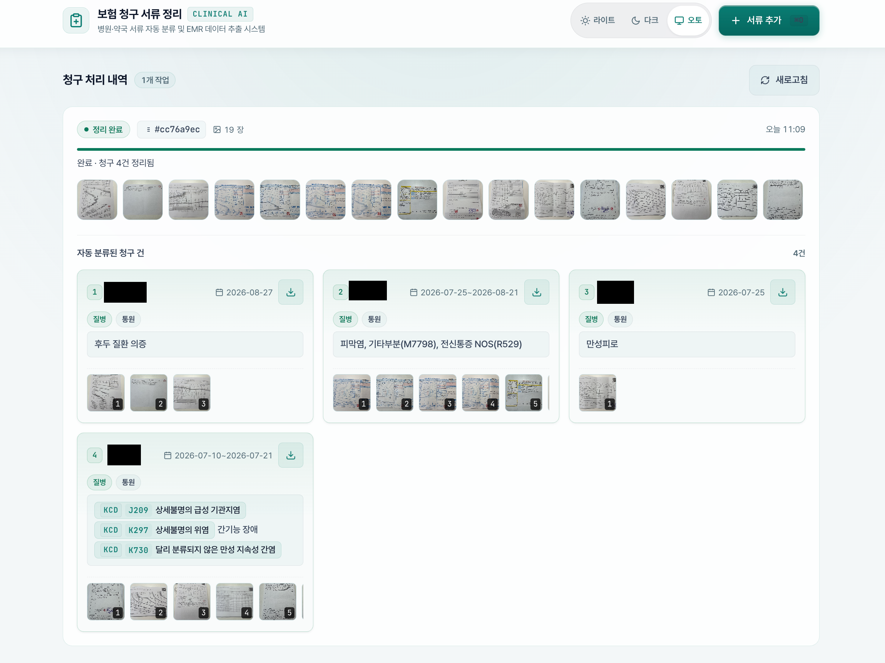

# insurance-claim



병원·약국 서류 사진(진단서, 처방전, 영수증 등)을 업로드하면:

1. **서류 구분** — 비전 LLM이 환자 / 날짜 / 진단명(또는 사고) 기준으로 그룹을 묶고,
   `data/claims/YYYY-MM-DD_환자_진단명/` 디렉터리에 JPEG로 변환한 사진을 복제합니다.
2. **정보 추출** — 각 그룹의 사진에서 보험 청구 항목을 읽어 그 디렉터리에 `summary.yaml`로 저장합니다.

웹 UI에서 **서류 추가** 버튼을 눌러 사진 선택 또는 드래그앤드랍으로 시작하고, 진행 상태
(구분중/추출중)와 청구건별 카드(환자·날짜·진단명)를 볼 수 있습니다. 완료된 각 청구 건은
JPEG 이미지와 `summary.yaml`이 담긴 ZIP 파일로 다운로드할 수 있습니다.

## 실행

```bash
uv sync
cp .env.example .env   # LLM_BASE_URL / LLM_API_KEY / VISION_MODEL 설정
uv run uvicorn backend.main:app --host 0.0.0.0 --port 8321
# 또는: uv run python backend/main.py
```

`http://localhost:8321` 접속.

## Docker로 실행

```bash
cp .env.example .env   # LLM_BASE_URL / LLM_API_KEY / VISION_MODEL 설정
docker compose up -d --build
```

- `frontend` (nginx) 가 정적 UI 를 서빙하고 `/api` 를 `backend` 로 프록시 → `http://localhost:8321`
- 업로드 원본 / 분류 결과는 호스트의 `./data` 에 저장됨 (`docker compose down` 후에도 유지)
- 컨테이너만 지우고 이미지는 남기면 `docker compose down`, 로그는 `docker compose logs -f backend`
- Linux 에서는 `mkdir -p data && sudo chown -R 1000:1000 data` 가 먼저 필요 (컨테이너는 uid 1000 으로 실행)

### GHCR 배포 이미지로 실행 (amd64 / arm64)

소스 코드 빌드 없이 GitHub Actions에서 빌드된 최신 멀티 아키텍처 이미지를 바로 사용할 수 있습니다:

```bash
docker compose -f docker-compose.ghcr.yml up -d
```


## summary.yaml 스키마

```yaml
환자: 홍길동
청구사유: 상해 | 질병
입원구분: 입원 | 통원
치료기간: YYYY-MM-DD~YYYY-MM-DD
진단명(사고 상세내용): 진단명 또는 사고 상세내용
사고경위: (상해일 때만)
사고장소: (상해일 때만)
사고일시: "YYYY-MM-DD HH:MM" (상해일 때만)
_meta:
  job_id: ...
  generated_at: ...
  images: [...]
  warnings: (수동 확인이 필요한 경우)
```

## 구조

```
backend/
  main.py      FastAPI: 업로드/상태/이미지 API + 정적 서빙
  pipeline.py  잡 상태, 분류→복제→추출→summary.yaml 파이프라인
  vision.py    OpenAI 호환 비전 호출 (이미지 리사이즈/base64, JSON 파싱)
  prompts.py   분류·추출 프롬프트
frontend/      정적 웹 UI (drag&drop, 폴링, 카드)
data/
  uploads/<job_id>/  업로드 원본 ( 보존 )
  claims/<청구>/     JPEG로 변환된 사진 + summary.yaml
```

## 주의

> **민감 정보 경고** — 업로드되는 서류에는 환자 성명, 진단명, 진료·조제 내역 등 개인·의료정보가 포함됩니다.
> `data/`(원본·분류 결과)와 웹앱을 인터넷에 공개하거나, 인증 없이 접근 가능한 환경에 두지 마세요.
> 이 프로젝트는 로컬·사설망에서의 개인 사용을 전제로 하며, 공개 배포용 보안(인증·암호화·접근 통제)은 포함하지 않습니다.

- 원본은 `data/uploads/`에 남고, 청구 폴더에는 **복사**됩니다.
- LLM이 확신을 못 한 항목은 `null` + `_meta.warnings`로 표시하고 추측하지 않습니다.
- 서버 재시작 시 진행중이던 잡은 `failed`로 표시되니 다시 업로드하세요.

## 라이선스

이 프로젝트는 [MIT 라이선스](LICENSE)를 따릅니다.

